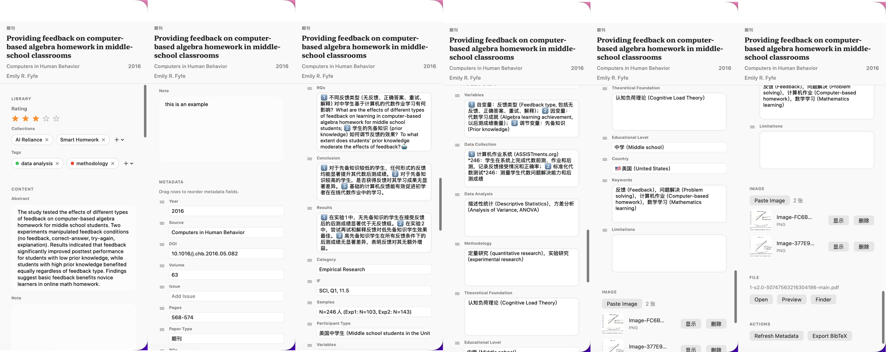

[简体中文](./README.md) | English

# Litrix

Litrix is a native macOS literature manager built with SwiftUI. It helps you import PDFs, BibTeX files, and DOI records, organize metadata, take notes, and export structured results into your writing workflow.

The goal is not to become a heavy all-in-one platform, but to provide a lightweight, local-first workspace for research papers on macOS.

## What It Is For

- Manage paper PDFs and metadata in one place
- Enrich records from filenames, DOI, Crossref, and AI models
- Organize reading workflows with collections, tags, ratings, and notes
- Export BibTeX, detailed Markdown summaries, and attachments

## Current Features

- Native macOS three-column interface
- PDF import with local paper-folder organization
- BibTeX import
- DOI import via Crossref
- AI-based metadata enrichment from PDF text
- SiliconFlow and DashScope support
- Collections, tags, ratings, image attachments, and plain-text notes
- Quick Look preview, open in default app, reveal in Finder
- Search and advanced search
- BibTeX export, Markdown detail export, attachment export
- Automatic `library.json` persistence and backups

## Requirements

- macOS 14 or later
- Xcode 26.3+ or Swift 6.2+
- An API key is only required for AI metadata enrichment

This repository has been checked locally with `Swift 6.2.4` and `Xcode 26.3`.

## Quick Start

### 1. Clone the repository

```bash
git clone https://github.com/<your-name>/<your-repo>.git
cd <your-repo>
```

### 2. Build and run

```bash
swift build
swift run Litrix
```

You can also open the Swift Package directly in Xcode and run it there.

## Packaging

The repository already includes scripts for building the macOS app bundle and DMG:

```bash
chmod +x publish.sh build_dmg.sh
./publish.sh
```

If `create-dmg` is installed on your machine, the script will also generate `Litrix-Installer.dmg`.

## Data Locations

- App settings and library data: `~/Library/Application Support/Litrix/`
- Default paper directory: `~/Litrix/Papers/`
- Backup directory: `~/Library/Application Support/Litrix/Backups/`

The paper directory can be changed in the app settings.

## Screenshot Placeholders

You can place screenshots in `docs/images/` and then add lines like these:

```md


```

## Repository Layout

- `Sources/PaperDockApp/`: main application source
- `Package.swift`: Swift Package manifest
- `publish.sh` / `build_dmg.sh`: local packaging scripts
- `ApiCallTest/`: API test scripts

## Notes

- This repository is set up to avoid committing `.app`, `.dmg`, build caches, and local sample paper PDFs.
- Before publishing publicly, make sure your sample papers, screenshots, and icons are safe to redistribute.
