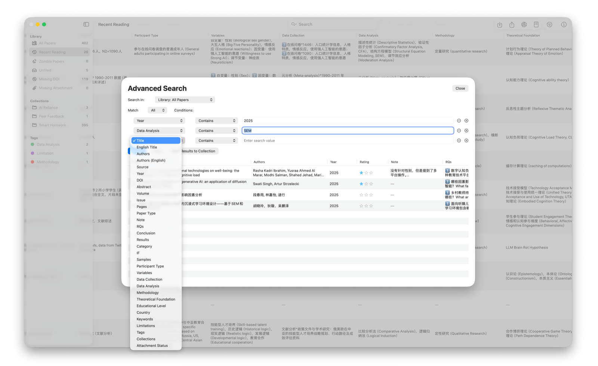
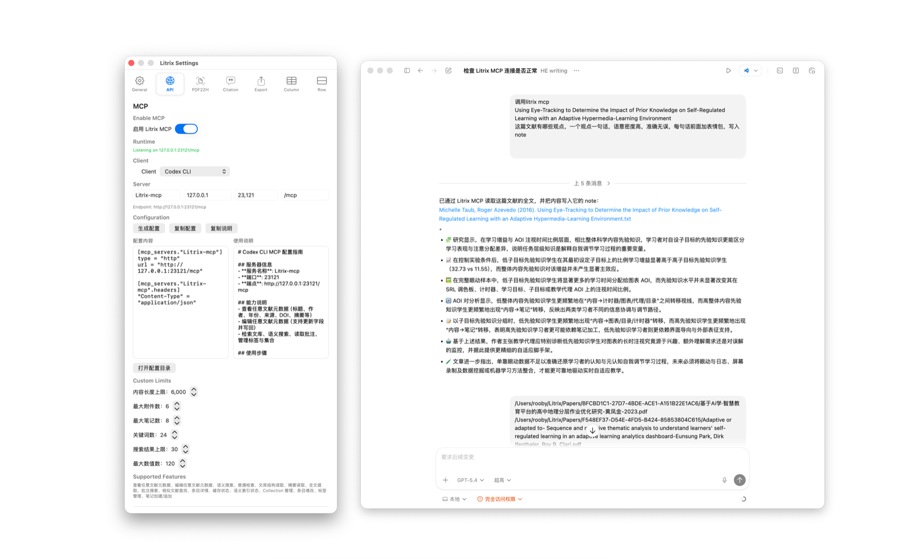
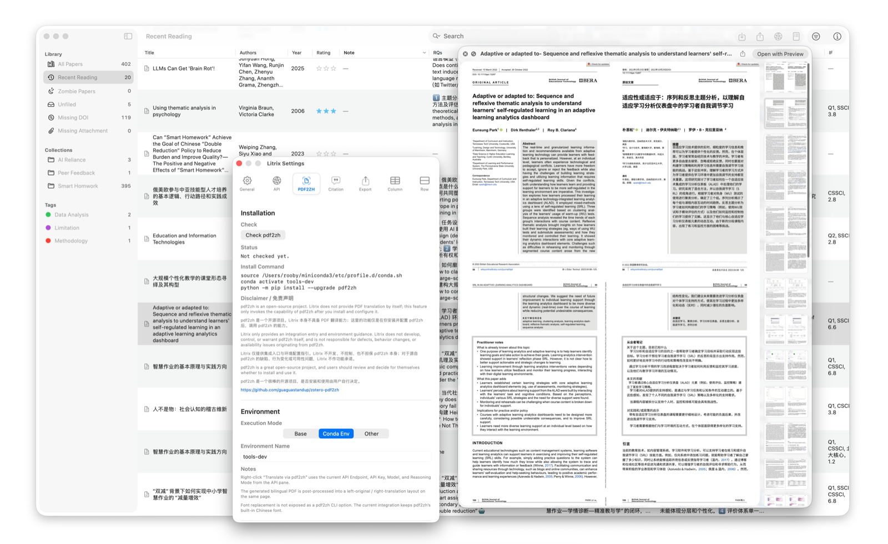
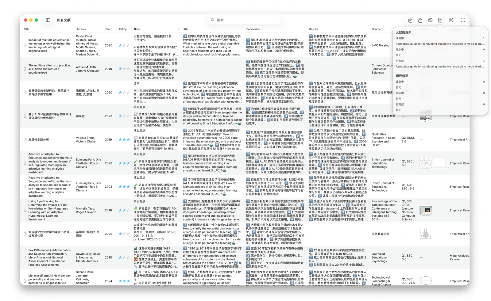
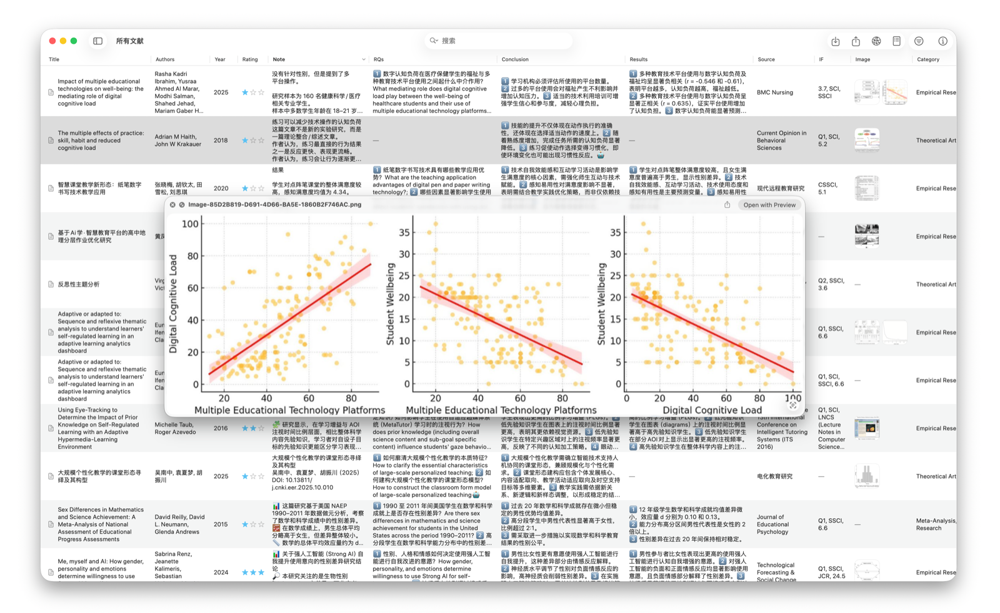

[English](./README.en.md) | 简体中文

# Litrix

Litrix 是一款原生 macOS 文献矩阵工具，面向研究生、科研人员与需要长期阅读论文的学生。它围绕导入、整理、阅读、批注、筛选、导出与 AI 协作设计，尽量把重复劳动压缩到最少，让阅读精力回到笔记、比较和判断本身。

## 版本信息

- 当前版本：`1.77`
- 平台：macOS 14+
- 技术栈：SwiftUI + Swift 6.2
- 发布形态：源码仓库 + macOS `.dmg` 安装包

## 1.77 当前能力

### 导入与建库

- 导入 PDF，并自动整理到本地 `Papers` 目录
- 导入 BibTeX
- 通过 DOI 从 Crossref 拉取元数据
- 基于 PDF 文本进行 AI 元数据补全与刷新
- 支持 `.litrix` 归档导入导出，便于备份、迁移和分享文献矩阵

### 文献矩阵与阅读工作流

- 原生 macOS 三栏界面
- 文献矩阵支持直接编辑
- 支持隐藏列、左右移动列、重排列顺序
- 支持高级搜索与高级筛选
- 支持文内引用格式检索
- 支持 `Collection`、`Tag`、`Zombie Collection` 等多种管理视角
- 支持分类、标签、评分、图片附件、纯文本笔记
- 支持图片悬停后按空格预览
- 支持 Quick Look 预览、默认应用打开 PDF、在 Finder 中定位文件

### AI 与自动化

- 支持 SiliconFlow 与阿里云百炼接口
- 元数据刷新支持按字段拆分 prompt，减少无效 token 消耗
- 工具栏支持 API 连接状态检测
- 工具栏支持元数据提取进度显示
- 内置 Litrix MCP，可供 AI 读取文献、读取 PDF 全文、修改元数据、写入 note、管理标签与集合

### 存储与导出

- `library.json` 自动保存与历史备份
- note 固定为 `note.txt`，图片固定存放在 `images/` 子目录
- 支持导出 BibTeX、Markdown 详情与附件
- 本地优先，默认数据目录清晰可追踪

## 截图

### 搜索与矩阵字段



### Litrix MCP



### pdf2zh 终端集成

Litrix 没有直接内置 `pdf2zh`，而是提供终端调用方式，方便你在本机已安装 `pdf2zh` 的前提下发起双页翻译流程。



### 任务进度显示



### 图片预览



## 系统要求

- macOS 14 或更高版本
- Xcode 26.3+ 或 Swift 6.2+
- 如需 AI 元数据增强，需要在应用设置中填写 API Key

本仓库当前已在本地环境通过 `Swift 6.2.4` 与 `Xcode 26.3` 构建检查。

## 快速开始

### 克隆仓库

```bash
git clone https://github.com/Rooby0921/Litrix.git
cd Litrix
```

### 编译与运行

```bash
swift build
swift run Litrix
```

也可以直接用 Xcode 打开这个 Swift Package 运行。

## 打包应用

仓库已包含 `.app` 与 `.dmg` 打包脚本：

```bash
chmod +x package_app_arm.sh build_dmg.sh publish.sh
./publish.sh
```

如果你只想生成 Apple Silicon 版本：

```bash
./package_app_arm.sh -v 1.77 -o ./dist
```

## pdf2zh 终端准备

Litrix 只提供终端调用入口，不会自动捆绑第三方翻译工具。你可以先在本机自行安装 `pdf2zh`，再回到 Litrix 中调用相关流程。

示例：

```bash
pip install pdf2zh
pdf2zh --help
```

## 数据位置

- 应用设置与库文件：`~/Library/Application Support/Litrix/`
- 默认文献目录：`~/Litrix/Papers/`
- 备份目录：`~/Library/Application Support/Litrix/Backups/`

文献目录可在设置中修改。当前存储结构说明见 [docs/storage-layout.md](./docs/storage-layout.md)。

## 仓库结构

- `Sources/PaperDockApp/`：主应用源码
- `docs/storage-layout.md`：当前数据结构说明
- `package_app_arm.sh` / `build_dmg.sh` / `publish.sh`：打包脚本
- `ApiCallTest/`：接口测试脚本

## 说明

- 仓库默认不提交 `.app`、`.dmg`、构建缓存与本地测试论文 PDF
- README 中展示的 `pdf2zh` 为外部工具接入方式，不是仓库内置分发内容
