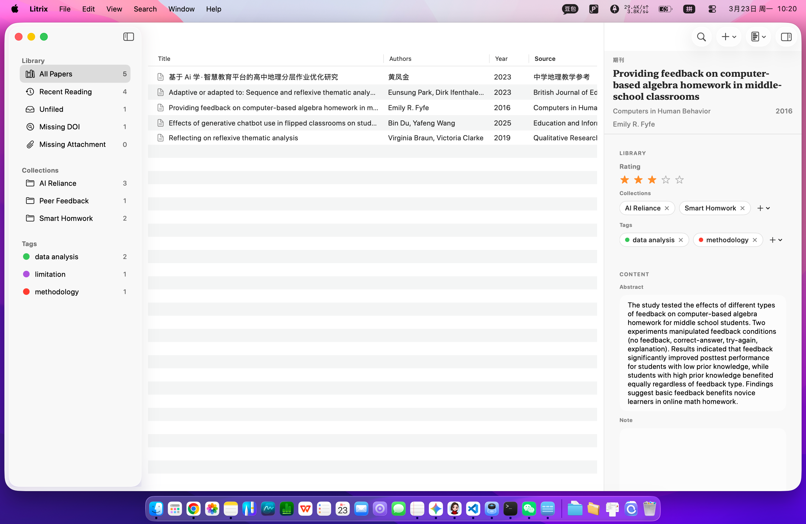
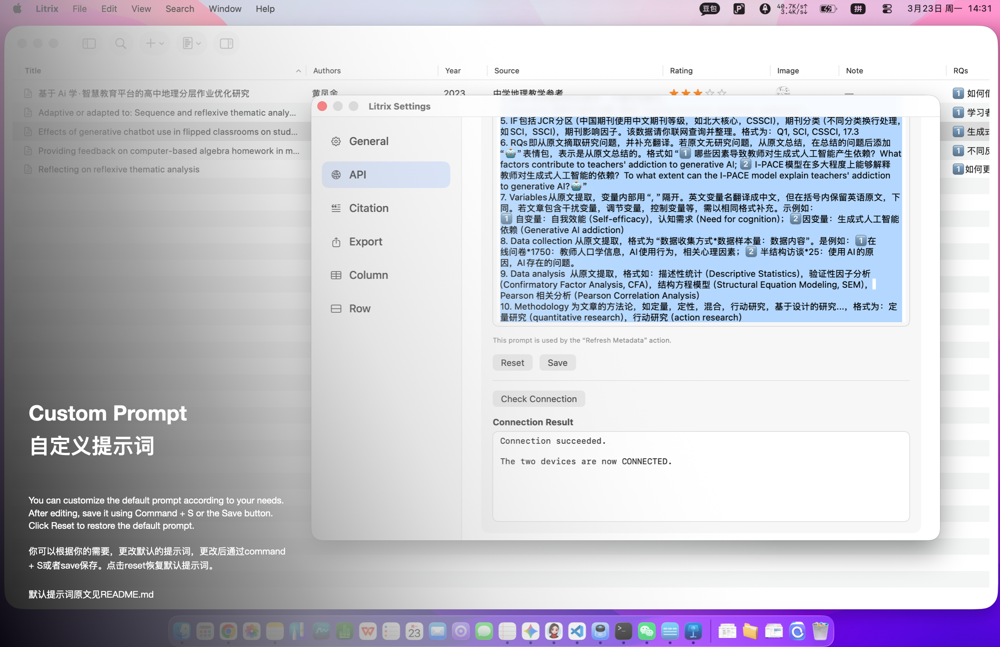

[English](./README.md) | [简体中文](./README.zh-CN.md)

# Litrix
Litrix由literature和matrix两个词构成，旨在通过矩阵的方式管理本地文献。Litrix的设计参考Zotero，Lattice以及Tahoe访达窗口，是多种设计风格的整合。
Litrix仅用于交流学习，承诺永不收费。

# 初衷
无论是Zotero，还是Lattice，都是在尝试如何优雅地展示文献摘要，未涉及对文献更深层次内容的探索，如研究方法，研究问题，结论，局限，图表设计，即他们都在尝试如何设计一个功能强大（Zotero），界面优美（Lattice）的工具，而不是重点关注如何让用户专注于阅读工作流，以提高阅读的深度和收获。如果你想对文献进行快速且更深入的了解，你需要先找到文献（不一定找到），再打开文献阅读（可能卡顿），再在文献中查找关键内容（你记不得的，尤其是英文，于是漫长的时间过去了）。这是一套非常耗时但又低收获的工作流，即便是在最新的Lattice工具中，你也很难第一时间找到文献的研究问题，局限，图表设计，以及最关键的，你曾经的思考。作者身边的同学早在Lattice发布之前，就尝试了新的探索。存在两种典型，一种是在Zotero整理文献的基础上，做Literature文档，即将别人的观点分类整合在一个文件中，然后注释自己对文献的思考。第二种是尝试利用excel重新规整文献，而zotero则成为收集与阅读的可替代品。这类同学往往觉得直接在网页阅读更方便，且更节约成本（如时间，内存等）。值得注意的是，笔者认为，没有一种工作流应该被奉为圭臬。每个人的操作偏好，学科背景，思维习惯决定了他们有唯一适合自己的工作方式。然而，作者亦认为，有必要探索一种在理论上更便捷的文献阅读和笔记方法，以帮助更多的同学沉浸于阅读，加深文献阅读的深度，同时，也能快速获取文献的深度信息。
鉴于上述局限，作者以审慎的态度了解了Github开源规则，决定以Zotero，Lattice为蓝本，重新设计一个文献阅读程序，即Litrix。Litrix对两位前辈进行了借鉴，但在代码，功能设计与理念上存在根本不同。在界面设计上，Litrix与Lattice未盈利的beta版在左边栏上类似，但Lattice的设计又与访达类似。后期，如果有用户认为Litrix是Lattice的副本或者同一产品的不同版本，以至于无法准确区分Litrix和Lattice，作者将对Litrix的设计进行更独立风格化的打造。

*将literature和matrix的组合。*

作者对身边的同学进行了口头调研（*n* = 10），发现更多同学选择在excel中做文献笔记。他们认为，excel能够快速地呈现文献的重点信息，比如研究问题，方法，样本量，创新点，同时也利于自己做笔记，比如文献对自己的启发，哪些值得takeaway，哪些值得criticism。笔者最后询问，这些在zotero中也可以实现，为什么要在表格中制作。几个关键的回答是：“zotero无法自定义列”，“zotero只有一行，根本展示那么多内容”，“zotero不能放图片”，“zotero查看内容的时候，我要点击进入二级菜单才能看到我的笔记”，“zotero太卡顿”，“zotero不好看”...笔者在这里只展示了反对者的声音，但众所周知，zotero绝对是一段功能强大的文献管理程序。
既然excel如此方便，直接用excel不就好了？
excel固然具备许多优势，但它的工作量极大。某位同学想提取文献中的研究问题，方法论，数据分析方法，实验设计等信息，必须从原文中复制和撰写。尽管交谈发现，这一过程在涉及深度阅读时，并不会占用他太多时间，但这种低阶重复性工作让这位同学感到繁琐。

*时代的潮流会冲洗每一颗沙粒*

教育技术学是一个尴尬的学科。在现实价值这件事情上，乐观派认为，教育技术学比计算机更懂教育，比教育学更懂技术。悲观派认为，教育技术学既不会计算机，也不能教育。后者并不是无据可依，也不见得全是学生的问题。一些学校将教育技术学划分到理学，很巧合的，既不是计算机（08），也不是教育学（04），教育技术学的学生确实去不了计算机岗，也去不了教育学岗位。笔者对教育技术学现实价值的认知更倾向于悲观派，但笔者认为，存在即是合理的，学科背景是一块敲门砖，但凡事总有例外，就像原则总会被打破。只是乐观派属于是过于乐观了。想来原因非常多，塞博杨迪老师结合大量案例，作出了很深刻的[分析](https://www.xiaohongshu.com/discovery/item/694f3458000000002103eede?source=webshare&xhsshare=pc_web&xsec_token=ABCfxTaZd1R9qsjwo6jD8L9KXFMxjSL3IEyrBFotewak4=&xsec_source=pc_share)。
之所以谈到教育技术学，是因为这个尴尬的学科在智能时代正在以极强的生命力蓬勃发文。每一轮新技术的出现，都会让教育技术学如久旱逢甘露，而笔者也是这批教育技术学莘莘学子中的一员。
笔者尝试用Codex编程，被他的agent能力深深折服。笔者也因此多了感叹。网友们时常调侃，“何同学”是5G的最大受益者。站在教育技术学学生的视角，教育技术学也可以是AI的“最”大受益者。在笔者看来，何同学的成功不是因为5G诞生本身，而是其对5G热点的精准把控和设计。网友嘲笑何同学不懂技术，但不可否认他在B站的成功。
于是，我谨慎地查阅了开源手册，尝试设计一款以构建矩阵为目标的文献整理程序。

*尾声*

感谢您的耐心阅读。事情完全可以用一句凝练的话讲完，就像我们写外文一样，将语意高度压缩。但在这个充斥着AI文本的时代，人类的啰嗦，似乎逐渐成为我之为人的一种确证。祝您身体健康，平安顺遂，这是最基础的，也是最容易被忽视的，你一定要记得～

## 关键设计
### 直接干脆的文献矩阵

Litrix改变了传统文献管理工具局促的单行展示方式。通过扩展行功能（快捷键 Command + =），用户可以在一个界面内直观地查阅单条文献的深度信息。配合空格键大图预览功能，复杂的实验图表、流程图等视觉信息不再隐藏在二级菜单中，让文献整理体验如同操作 Excel一样高效，却比Excel更直观、更易读。此外，你可以通过敲击空格放大矩阵中的图片，这是许多exceler梦寐以求的功能。

 

 

### AI驱动的自动化工作流

不同于以往，文献页仅支持纯文本的工具，Litrix强调了图片在文献阅读中的重要性。用户在阅读论文时产出的关键笔记、文献中的关键实验图，数据分析的关键细节都可以截图快速粘贴到文献元数据。此外，用户可以通过 Command + N 快速创建或访问文字笔记。

### 高度开放的矩阵自主权

Litrix支持用户自定义元数据抓取提示词。用户可以通过硅基流动（SiliconCloud）或阿里云百炼等平台免费获取API。这一设计让AI能够深度参与到文献处理流程中，协助用户自动提取、分类和汇总那些细碎但至关重要的科研信息，将研究者从繁琐的机械录入中解放出来，专注于高价值的思考与创作。未来，Litrix计划增加类似excel的功能，允许用户自定义列标题。如果您觉得当前的元数据类型过多，您可以在菜单栏Litrix/Setting/Column中关闭。

### 高效精准的查找与引用

在Litrix中，选中文献后按 Command + C 可以直接复制文内引用，按 Command + Shift + C 可以直接复制文末参考文献条目；按 Command + F 可以快速打开搜索框，按 Command + Shift + F 可以进入高级搜索界面。这样可以在写作、记笔记和整理文献时，更快地完成引用插入与文献定位，减少重复查找和手动操作。此外，Litrix提供搜索，高级搜索，collection，tags以及recent reading功能，方便你快速找到你想要的文献。

## 项目用途

- 像Excel一样制作文献矩阵
- 通过AI自动创建文献原始信息
- 用分类、标签、评分、笔记快速查看文献
- 用多种检索方式快速查找文献
- Zotero从未有过的扩展行视图
- Zotero 9才有的Recent Reading
- 导出 BibTeX、Markdown详情和附件
- 比自动还方便的手动引用
- 好看的界面设计（借鉴Lattice，那是一款异常精致的文献管理工具，https://github.com/stringer07/Lattice_release/releases）

## 系统要求

- macOS 14 或更高版本
- Xcode 26.3+ 或 Swift 6.2+
- 如需 AI 元数据增强，需要在应用设置中填写 API Key

本仓库当前在本地环境中已通过 `Swift 6.2.4` 和 `Xcode 26.3` 检查。

## 快捷键说明

快捷键是Litrix的核心功能之一。

### 主界面

| 快捷键 | 作用 |
| --- | --- |
| `⌘N` | 为当前选中文献新建纯文本笔记 |
| `⌘F` | 聚焦搜索框；再次按 `⌘F` 或按 `Esc` 退出搜索 |
| `⌘⇧F` | 打开高级搜索 |
| `Space` | Quick Look 预览当前选中文献的 PDF；若鼠标悬停在图片缩略图上，则预览图片 |
| `Return` / `Enter` | 打开当前选中文献的 PDF |
| `↑` | 选中上一条文献 |
| `↓` | 选中下一条文献 |
| `⌘Delete` | 删除当前选中文献 |
| `⌘A` | 选中当前列表中所有可见文献 |
| `⌘[` | 显示或隐藏左侧边栏 |
| `⌘]` | 显示或隐藏右侧元数据面板 |
| `⌘-` | 切换为紧凑行高 |
| `⌘=` / `⌘+` | 切换为扩展行高 |

### 引用复制

| 快捷键 | 作用 |
| --- | --- |
| `⌘C` | 复制当前选中文献的文内引用，例如 `(Du & Wang, 2025)` |
| `⌘⇧C` | 复制当前选中文献的参考文献条目 |

### 快速标签

| 快捷键 | 作用 |
| --- | --- |
| `1` 到 `9` | 将对应编号的快捷标签应用到当前选中文献 |

说明：需要先在设置中为标签分配快捷编号；支持对多选文献批量应用。

### 侧边栏

| 快捷键 | 作用 |
| --- | --- |
| `Return` / `Enter` | 对当前选中的分类或标签进行内联重命名 |

### 高级搜索窗口

| 快捷键 | 作用 |
| --- | --- |
| `Return` | 执行搜索 |
| `Esc` | 关闭高级搜索窗口 |

### 笔记窗口

| 快捷键 | 作用 |
| --- | --- |
| `⌘W` | 关闭笔记窗口 |
| `⌘N` | 为当前选中文献新建纯文本笔记 |

### 弹窗与表单

| 快捷键 | 作用 |
| --- | --- |
| `Return` | 在 DOI 导入窗口中执行导入 |
| `Return` | 在新建分类 / 新建标签窗口中执行保存 |
| `Return` | 在自定义添加项弹窗中执行添加 |

### 设置页

| 快捷键 | 作用 |
| --- | --- |
| `⌘S` | 保存 Metadata Prompt 草稿 |

## 截图预留

主界面

元数据面板内容（你可以在“菜单栏/Litrix/setting/API/Metadata Prompt"中通过修改提示词来改变元数据提取内容和格式）

## 发布内容

- `Litrix-0.9-beta1.dmg`：安装包
- `API配置教程[中文].pdf`：API 配置教程
- `docs/images/`：当前仓库使用的截图资源

## 已知问题
由于作者精力有限，部分已知但危害性不大的问题还未解决，这些问题将在后续版本中得到改善。如果你发现新的bug，也欢迎您的反馈，反馈邮箱：robby260314@gmail.com
1 工具栏的布局无法保存
2 右边栏呼出动画不够流畅
3 部分界面的提示为中文，但目标语言其实是英文
4 没有深色模式
5 没有语言切换选项
6 高级检索目前无法锁定自定义Collection
7 这篇文档仍有许多错别字，以后慢慢改吧，先睡一觉

## 邀请
欢迎通过 GitHub Issues 提交使用反馈、错误报告与功能建议。如果你在使用过程中遇到问题，请尽量说明你的 macOS 版本、操作步骤、预期结果、实际结果，以及相关截图或示例文件；如果你有新的功能想法，也非常欢迎分享你的使用场景与需求背景，这会帮助我更好地判断功能设计方向。Litrix目前仍在持续迭代中，任何来自真实使用场景的反馈、测试和贡献，都会对这个项目的改进非常有帮助。未避免利益纠纷，Litrix不对原始代码进行开源，但Litrix承诺，永不付费。

## 免责声明
本项目由作者在OpenAI Codex的辅助下完成开发（60% vibe coding，其实完全可以100%）。作者本人并非计算机专业出身，而是自学编程。作者已对项目内容进行了人工检查，并尽力避免未经授权的代码复用、抄袭或其他知识产权问题。但由于 AI 辅助生成内容存在一定不可完全预见性，若任何个人或组织认为本项目存在侵权、复用不当或其他相关争议，请尽快通过公开仓库或邮箱（robby260314@gmail.com）与作者联系，作者将在核实后积极配合处理与修改。

本项目在程序界面组织与交互模式上参考了 Lattice，Zotero，访达等资源管理工具，相关参考主要限于平面设计层面，并不涉及其源码、图标、截图、文案或其他资源文件的直接复制。根据著作权法的一般原则，版权通常保护软件中的受保护表达，而不当然延伸至抽象的思想、程序逻辑、系统、方法或布局本身；但若相关权利人认为本项目在具体表达层面仍存在不妥之处，欢迎联系作者沟通，作者将以尊重、审慎的态度及时处理。

本项目仅以公开交流、学习研究和个人使用为目的发布。作者本人未在任何渠道以付费方式出售、授权收费分发或强制捆绑收费提供本程序。若第三方未经作者许可擅自以付费、强制收费、捆绑收费或其他不当方式传播本程序，该行为与作者无关，也不代表作者立场。请用户自行甄别相关渠道，谨防误导或不当收费行为。举报邮箱：robby260314@gmail.com

## 伦理公开
本项目的开发过程中使用了AI编程辅助工具，以提升原型实现效率。作者始终将人工审阅、人工修改与人工判断作为最终发布前的必要环节，并尽量避免直接采纳来源不明、授权不清或可能涉及知识产权风险的内容。

## 致谢
衷心感谢Zotero与Lattice在文献管理软件领域所做出的优秀探索与贡献。它们的产品为作者创作文献管理工具的界面设计提供了重要启发。Zotero是一款强大的文献管理工具，深受广大用户喜爱。Lattice是继Zotero之后，一款异常精致的文献管理软件，其产品得到了用户的广泛好评，相关介绍见[Lattice_release](https://github.com/stringer07/Lattice_release/blob/master/README.zh-CN.md)。此外，感谢OpenAI Codex在本项目开发过程中提供的辅助支持，帮助作者以非计算机专业背景完成原型实现（这句话是codex要求我写的）
